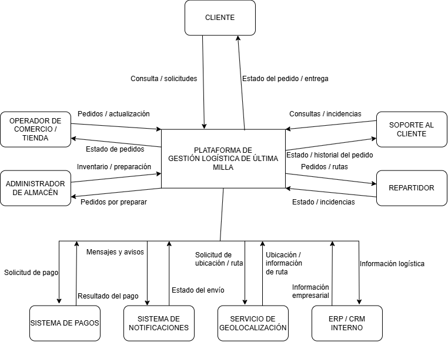

# Gestión Logística de Última Milla

## Actividad 1: Diagnóstico y contexto arquitectónico

Proyecto orientado al análisis inicial de una plataforma de gestión logística de última milla para una empresa de retail digital.

El objetivo de esta actividad es comprender el problema, el contexto, los actores, el alcance, las restricciones y los riesgos del sistema antes de tomar decisiones relacionadas con tecnologías o arquitectura.

---

## 1. Resumen ejecutivo

La empresa de retail digital recibe pedidos desde diferentes canales, maneja inventarios distribuidos y debe coordinar almacenes, rutas y repartidores para realizar las entregas.

Actualmente no cuenta con una vista centralizada del estado real de cada pedido. Esta situación puede generar duplicación de información, inconsistencias de inventario, retrasos, errores operativos y dificultades para realizar seguimiento a las entregas.

Como solución inicial se propone una plataforma centralizada de gestión logística de última milla que permita organizar la información de los pedidos, validar inventarios, gestionar rutas, realizar seguimiento de las entregas y registrar incidencias.

La plataforma busca mejorar la coordinación entre las diferentes áreas y facilitar la trazabilidad de los pedidos.

---

## 2. Problema

La empresa maneja diferentes procesos relacionados con los pedidos y las entregas, pero la información no se encuentra completamente centralizada.

Esto dificulta conocer de manera clara y actualizada el estado de cada pedido y puede generar problemas entre las áreas encargadas de los almacenes, las rutas, los repartidores y el soporte al cliente.

Entre las principales consecuencias se encuentran:

* Duplicación de pedidos.
* Inconsistencias de inventario.
* Retrasos en las entregas.
* Entregas fallidas.
* Pérdida de trazabilidad.
* Problemas de coordinación.
* Mayor cantidad de reclamos de los clientes.

---

## 3. Objetivo

Proponer inicialmente una plataforma centralizada que permita gestionar y consultar la información relacionada con la logística de última milla, facilitando la coordinación entre pedidos, inventario, almacenes, rutas, repartidores y soporte al cliente.

---

## 4. Actores del sistema

Los principales actores identificados son:

* **Cliente:** consulta el estado de sus pedidos y recibe información relacionada con las entregas.
* **Operador de comercio o tienda:** registra y gestiona los pedidos.
* **Administrador de almacén:** gestiona información relacionada con inventarios y preparación de pedidos.
* **Repartidor:** recibe pedidos y rutas asignadas y actualiza el estado de las entregas.
* **Soporte al cliente:** consulta pedidos y gestiona incidencias y solicitudes.
* **Sistema de pagos:** permite validar la información relacionada con los pagos.
* **Servicio de geolocalización:** proporciona información de ubicación y rutas.
* **Sistema de notificaciones:** permite enviar mensajes y avisos.
* **ERP / CRM interno:** intercambia información necesaria para los procesos internos de la empresa.

---

## 5. Alcance

### Dentro del alcance

* Gestión y consulta de pedidos.
* Validación de inventario.
* Gestión de preparación de pedidos.
* Asignación de rutas y repartidores.
* Seguimiento de entregas.
* Registro de incidencias.
* Consulta de información para soporte.
* Integración con sistemas externos relacionados con la operación.

### Fuera del alcance

* Crear una tienda virtual completa.
* Crear un sistema de pagos propio.
* Crear un ERP.
* Crear un CRM.
* Reemplazar todos los sistemas actuales de la empresa.
* Gestionar directamente todos los procesos financieros y contables.

---

## 6. Restricciones

Entre las principales restricciones identificadas se encuentran:

* Dependencia de sistemas externos.
* Necesidad de proteger la información de clientes y operaciones.
* Dependencia de la conectividad para algunos actores.
* Crecimiento futuro de la cantidad de pedidos y usuarios.
* Necesidad de integrarse con sistemas existentes.
* Falta de información completa sobre la operación real de la empresa en esta etapa.

---

## 7. Riesgos principales

Los principales riesgos identificados son:

| ID    | Riesgo                           | Prioridad |
| ----- | -------------------------------- | --------- |
| R-001 | Duplicación de pedidos           | Alta      |
| R-002 | Inconsistencias de inventario    | Alta      |
| R-003 | Entregas retrasadas              | Alta      |
| R-004 | Entregas fallidas                | Alta      |
| R-005 | Pérdida de trazabilidad          | Alta      |
| R-006 | Mala coordinación entre áreas    | Media     |
| R-007 | Crecimiento de la operación      | Media     |
| R-008 | Problemas de seguridad           | Alta      |
| R-009 | Dependencia de sistemas externos | Media     |
| R-010 | Información desactualizada       | Alta      |

---

## 8. Diagrama de contexto

El siguiente diagrama representa los principales actores, sistemas externos y flujos de información relacionados con la plataforma.

---

## 9. Decisiones iniciales

Las principales decisiones tomadas durante esta actividad son:

* Centralizar la información logística.
* Mantener la integración con los sistemas externos existentes.
* Registrar el estado de cada pedido.
* Validar la disponibilidad del inventario.
* Gestionar rutas y repartidores.
* Registrar las incidencias.
* Manejar diferentes tipos de usuarios.
* Mantener la trazabilidad de los pedidos.
* Considerar el crecimiento futuro de la operación.

En esta etapa todavía no se han seleccionado tecnologías, frameworks, bases de datos o una arquitectura específica, ya que primero se busca comprender el problema y el contexto del negocio.

* [x] Documentación organizada.
* [ ] Video de sustentación publicado.
